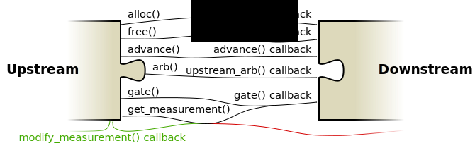

# Gate- and measurement streams

The gatestream interface connects frontends to backends, frontends to
operators, and operators to backends. There is a slight difference between
the three to do with the measurement path, but for the most part they are
the same. The following graphic shows the functions and callbacks used to
form the interface on either side.

The green datapaths only exist if the upstream plugin is an operator. The red
datapaths only exist if the downstream plugin is an operator.

## Allocating and freeing qubits

DQCsim allows upstream plugins to allocate qubits within the downstream
plugins at all times. This was done to provide a means for qubit mapping
operators to determine whether upstream qubits are in use or not, and because
it seems obvious in general coming from the classical world. Similar to a
classical computer, a backend with limited resources must make map the qubits
that are actually in use appropriately.

The `alloc()` function takes the number of qubits that are to be allocated as
an argument, as well as a list of `ArbCmd`s. The `ArbCmd`s can for instance be
used for various things, such as assigning a name to qubit registers for
debugging purposes or specifying error model information on a per-qubit basis.
In response, DQCsim allocates unique indices for the requested qubits and
returns them to the algorithm immediately. It also asynchronously sends an
allocation request through the gatestream, which causes the `alloc()` callback
to be called on the other end. This function takes the qubit indices that
DQCsim allocated for the qubits and the list of `ArbCmd`s as argument.

`free()` can be used to free previously allocated qubits. If these qubits are
still entangled, the backend should collapse the state in some way; however, it
is up to the backend to decide how to do this. `free()` only takes the list of
qubit indices that are to be freed as arguments.

Qubit indices are assigned by DQCsim in a deterministic way. The first
allocated qubit receives index 1. Subsequent allocations receive the next
index. This means that freed qubit indices are never reused; if a backend wants
to reuse indices internally, it must maintain its own mapping. Index 0 is
reserved for marking invalid qubits and the end of a qubit list in the C API.

## Sending gates

DQCsim internally represents gates using the following pieces of data:

 - an optional name;
 - a list of target qubits;
 - a list of control qubits;
 - a list of measured qubits;
 - an optional Pauli matrix, sized appropriately for the number of qubits in
   the target list;
 - an `ArbData` object that may contain classical arguments and/or additional
   information specifying the behavior of the gate.

It is not currently possible to send all the gates allowed by the above
representation through the C, C++, or Python APIs. Specifically, only the
following classes of gates can be constructed:

 - unitary gates, which consist of one or more target qubits, a Pauli matrix,
   and zero or more control qubits;
 - z-basis measurement gates, which consist of one or more measured qubits and
   nothing else;
 - custom gates, which have a name (required), zero or more target qubits, zero
   or more control qubits, zero or more measured qubits, an optional Pauli
   matrix, and `ArbData` information.

A backend *must* process gates according to the following algorithm.

On the receiving end, the behavior is standardized as follows.

 - If the gate does not have a name:
    - if there is a Pauli matrix:
       - turn the matrix into a controlled matrix with the appropriate number
         of control qubits (which may be zero), and
       - apply the matrix to the concatenation of the control and target
         qubits;
    - measure every qubit in the `measures` list in the Z basis. Note that this
      should be supported *in addition* to the application of a Pauli gate.
 - Otherwise, if the gate has a name recognized by the backend implementation,
   the behavior is up to the backend implementation.
 - Otherwise, the backend should return an error.

## Measurement results

Measurement objects in DQCsim consist of the following:

 - (usually) the index of the measured qubit;
 - the measured value, which may be zero, one, or undefined (to model a failed
   measurement);
 - an `ArbData` object that may contain additional information about the
   measurement.

The upstream plugin will store the result of the latest measurement performed
on a per-qubit basis. This storage can be queried using the `get_measurement()`
function. Measuring the same qubit twice without calling `get_measurement()` in
between is fine; in this case, the result of the first measurement is
discarded.

DQCsim requires that every qubit in the `measures` list of a gate results in
exactly one measurement being returned. Furthermore, it is illegal to return
measurement data for a qubit that was not measured. This has to do with
internal optimizations in the communication protocol. DQCsim will check whether
you fulfill these requirements, and issue warnings if you don't. The stored
measurement results become undefined in a potentionally non-deterministic way
after violating the protocol in this way, so it is important to fix these
warnings when you get them.

Note that operators do not need to return all measurement results immediately.
Specifically, if they propagate the measurement gate further downstream in some
way, the qubits measured by that gate must *not* be returned immediately.
Instead, these measurement results pass through the `modify_measurement()`
callback when they become available. `modify_measurement()` takes one
measurement result as an argument and can return zero or more measurements,
which will then be passed on to the upstream plugin. The only thing that
matters, ultimately, is that the measurements received by the upstream plugin
correspond exactly to the qubits it measured.

## Passing time

Gates in DQCsim are modeled as being performed sequentially and
instantaneously. Among other things, this allows operators to insert gates into
the gatestream at any time, without having to worry about violating boundary
conditions. However, DQCsim *does* have a basic concept of time.

Specifically, an integral cycle counter is maintained for every gatestream
interface. This cycle counter can be advanced by the specified number of cycles
using the `advance()` function, which results in the `advance()` callback being
called for the downstream plugin. Other than that, DQCsim does nothing with
this timing information.

This mechanism was introduced to provide a standardized way for upstream
plugins to specify how much time is passing to downstream plugins. This is
important specifically for error model operators, which may randomly insert
gates in response to the `advance()` callback to decohere the quantum state.

## Gatestream arbs

In addition to the above, the upstream plugin can send `ArbCmd`s to the
downstream plugin. These operate like synchronous remote procedure calls,
taking an `ArbCmd` as argument and sending an `ArbData` or error message in
response.

This mechanism can for instance be used to tell the downstream plugin to dump
its quantum state for debug purposes.
