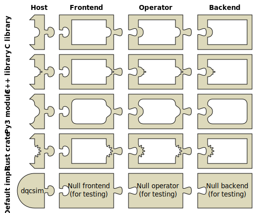
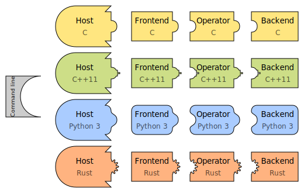
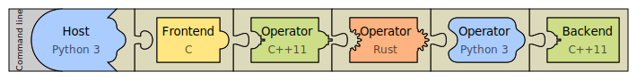

# Jigsaw puzzle analogy

One way to represent the components of DQCsim is through jigsaw puzzle pieces.
Each piece represents a component, while the shapes on the sides of the pieces
represent the interfaces. Just like in a jigsaw puzzle, these interfaces must
match exactly for the program to work.

Within this analogy, DQCsim provides the following jigsaw pieces.

But you can't make a finished (rectangular) puzzle with those pieces alone; you
need to add some of your own. You can use the following shapes:

Here's an example of a finished puzzle:

You could decide not to use DQCsim's pieces at all, by just connecting a C
frontend to a C backend, for instance. This actually only sort of works outside
the analogy, since DQCsim's gatestream sink interface does not correspond
*exactly* to its source interface, but you get the idea. However, you can't
just connect a Python frontend to a C++ backend. It doesn't fit; you'd have to
make an adapter piece first. You also can't add host logic easily, and don't
get a command line parser for free. This is what DQCsim provides for you.
